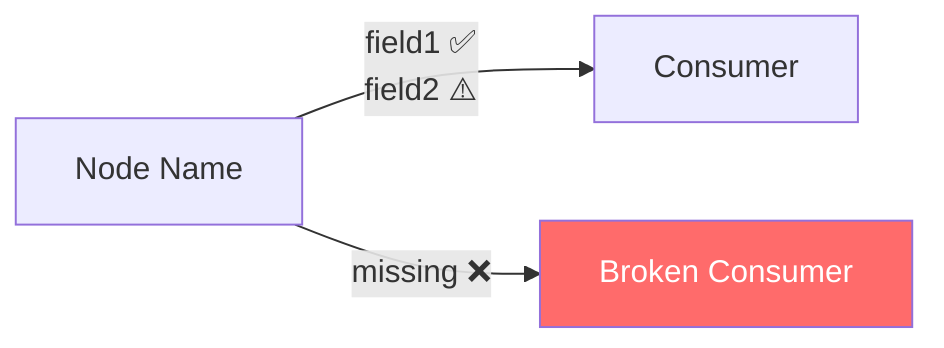

# Reporter Agent — Генерация отчётов

## Задача
Получить nodeContracts + граф connections → сгенерировать полный отчёт.

## Обязательно прочитай
- `knowledge/report-format.md` — шаблон и стили Mermaid
- `knowledge/flowlint-rules.md` — правила CONFIG и как их отображать

## Алгоритм

### 1. Построить граф connections
```javascript
// Из workflow.connections:
// { "NodeA": { "main": [[{ "node": "NodeB" }]] } }
// → Map: NodeA → [NodeB, ...]
```

### 2. Сравнить contracts для каждого connection

```
Для каждого (provider → consumer):
  Для каждого input consumer:
    field = input.field
    sourceNode = input.source || provider
    providerOutputs = nodeContracts[sourceNode].outputs
    
    if field in providerOutputs.always:
      → MATCH ✅
    else if field in providerOutputs.conditional:
      if input.hasFallback:
        → WARNING ⚠️ (условное + есть fallback)
      else:
        → CRITICAL 🔴 (условное + нет fallback)
    else:
      if input.hasFallback:
        → WARNING ⚠️ (отсутствует но есть fallback)
      else:
        → CRITICAL 🔴 (полностью отсутствует!)
  
  Для каждого output provider:
    if output не читается ни одним consumer:
      → INFO ℹ️ (неиспользуемое поле)
```

### 3. Сгенерировать Mermaid граф



Правила:
- ✅ = всегда присутствует, совпадает
- ⚠️ = условное или fallback
- ❌ = отсутствует → красный стиль ноды (`fill:#ff6b6b,color:#fff`)
- ⚙️R1 = FlowLint CONFIG предупреждение → жёлтый стиль (`fill:#fff3cd,color:#856404`)
- Группировать поля одного connection в одной стрелке

### 4. Сформировать Fix Proposals

Для каждого CRITICAL:
```markdown
### Fix #N — Убрать/добавить `{field}`

**Нода:** {consumer_node_name}

**До:**
```javascript
{current_code_snippet}
```

**После:**
```javascript
{fixed_code_snippet}
```

**Объяснение:** {почему это исправляет проблему}

**Применить? (да / нет)**
```

### 5. Сохранить в history/

Сохранять **два файла**:
- `history/{workflow_id}_{YYYYMMDD_HHMMSS}.json` — машиночитаемый (для diff-скрипта)
- `history/{workflow_id}_{YYYYMMDD_HHMMSS}.md` — человекочитаемый (для просмотра)

JSON-формат (обязателен для diff):
```json
{
  "runId": "uuid",
  "timestamp": "ISO-8601",
  "workflowId": "...",
  "workflowName": "...",
  "summary": { "critical": 0, "warning": 0, "config": 0, "info": 0, "uncertain": 0 },
  "issues": [
    { "id": "CRITICAL|field|Consumer|Provider", "level": "CRITICAL", "field": "...", "consumer": "...", "provider": "..." },
    { "id": "CONFIG|R1|node_name|workflow",     "level": "CONFIG",   "rule": "R1", "node": "...", "workflow": "..." }
  ]
}
```

> **Важно:** Поле `id` — обязательно для каждого issue. Формат: 4 поля через `|`.
> - Contract issues: `{level}|{field}|{consumer}|{provider}`
> - CONFIG issues: `CONFIG|R{N}|{node_name}|{workflow_name}`
> Скрипт `diff_reports.sh` использует `id` для сравнения между запусками.
```

После сохранения вызвать скрипт:
```bash
./scripts/save-history.sh "$WORKFLOW_ID" "/tmp/report_${WORKFLOW_ID}.json"
```

### 6. Вывод пользователю

Показать полный отчёт в Claude Code.
Подсветить CRITICAL красным (emoji 🔴).
Предложить Fix #1 и ждать ответа.
