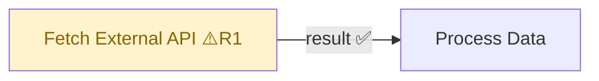

# FlowLint Rules — Встроенные правила конфигурационного аудита

Этот файл содержит правила из [FlowLint](https://flowlint.dev/) (статический линтер n8n workflow, декабрь 2025), **зашитые в базу знаний агента**.

Агент проверяет эти правила **автоматически** в рамках каждой `/validate` команды и включает результаты в отчёт под уровнем `🔧 CONFIG`.

Правила: **R1–R10** — все реализованы и применяются при каждом `/validate`.

---

## Отличие от Contract Testing

| | Contract Testing (основное) | FlowLint Rules (встроенные) |
|--|---|---|
| Что проверяет | Поля данных между нодами | Настройки и конфигурацию нод |
| Находит | `field_hint` у Consumer, `field` у Provider | HTTP Request без retry, generic node name |
| Уровень в отчёте | 🔴 CRITICAL / 🟡 WARNING | 🔧 CONFIG |
| Источник | Анализ jsCode + connections | Анализ параметров нод |

---

## Правила (R1–R10)

### R1 — HTTP Request: отсутствует retry/backoff конфигурация

**Что проверять:**
```javascript
node.type === 'n8n-nodes-base.httpRequest'
→ node.parameters.options?.retryOnFail !== true
```

**Уровень:** 🔧 CONFIG  
**Сообщение:** `Node "{name}": HTTP Request нода без "Retry on Fail". Включить в Options → Retry on Fail.`  
**Почему важно:** Без retry одна сетевая ошибка ломает весь workflow. Рекомендуемые настройки: maxTries: 3, waitBetweenTries: 1000ms.

**Как выглядит в n8n JSON:**
```json
{
  "type": "n8n-nodes-base.httpRequest",
  "parameters": {
    "options": {
      "retryOnFail": true,
      "maxTries": 3,
      "waitBetweenTries": 1000
    }
  }
}
```

---

### R2 — rate_limit_retry: параллельные запросы без ограничения concurrency

**Что проверять:**
```javascript
// Несколько HTTP Request нод в одном workflow без механизма throttle/batching
const httpNodes = workflow.nodes.filter(n => n.type === 'n8n-nodes-base.httpRequest');

// Признаки наличия throttle: Split In Batches или Wait между HTTP-нодами
const hasThrottle = workflow.nodes.some(n =>
  n.type === 'n8n-nodes-base.splitInBatches' ||
  n.type === 'n8n-nodes-base.wait'
);

if (httpNodes.length > 3 && !hasThrottle) {
  → R2 предупреждение
}
```

> ⚠️ **Что НЕ является индикатором throttle:** `workflow.settings.executionOrder` — это настройка порядка выполнения нод (v0/v1), она не имеет отношения к rate limiting.

---

### R3 — error_handling: отсутствует Error Workflow

**Что проверять:**
```javascript
// Проверить настройки workflow:
workflow.settings?.errorWorkflow === undefined || workflow.settings?.errorWorkflow === ''
```

**Уровень:** 🔧 CONFIG  
**Сообщение:** `Workflow не имеет Error Workflow. При ошибке исполнения не будет уведомления. Настроить: Workflow Settings → Error Workflow.`

---

### R4 — error_handling: continueOnFail включён

**Что проверять:**
```javascript
workflow.nodes.some(n => n.continueOnFail === true)
```

**Уровень:** 🔧 CONFIG (предупреждение, не ошибка)  
**Сообщение:** `Node "{name}": continueOnFail = true. Ошибки будут молча проглочены. Убедиться, что это намеренно.`

---

### R5 — secrets: хардкод credentials в параметрах

**Что проверять:**
```javascript
// Сканировать все string-параметры на паттерны секретов
const SECRET_PATTERNS = [
  /(?:api[_-]?key|apikey)\s*[:=]\s*['"][^'"]{10,}['"]/i,
  /(?:password|passwd|pwd)\s*[:=]\s*['"][^'"]{4,}['"]/i,
  /(?:token|secret|bearer)\s*[:=]\s*['"][^'"]{10,}['"]/i,
  /Bearer\s+[A-Za-z0-9\-._~+/]+=*/,
  /sk-[A-Za-z0-9]{20,}/,       // OpenAI ключи
  /ghp_[A-Za-z0-9]{36}/,       // GitHub Personal Access Token
];

// Для каждой ноды проверить все string-значения параметров рекурсивно
function scanForSecrets(obj, nodeName) {
  if (typeof obj === 'string') {
    for (const pattern of SECRET_PATTERNS) {
      if (pattern.test(obj)) {
        return `Node "${nodeName}": возможный хардкод секрета в параметрах`;
      }
    }
  }
  if (typeof obj === 'object' && obj !== null) {
    for (const val of Object.values(obj)) {
      const result = scanForSecrets(val, nodeName);
      if (result) return result;
    }
  }
  return null;
}
```

**Уровень:** 🔴 CRITICAL (секрет в коде = критическая проблема безопасности)  
**Сообщение:** `Node "{name}": найден возможный хардкод credentials. Использовать n8n Credentials вместо inline-значений.`

---

### R6 — idempotency: операции без идемпотентности

**Что проверять:**
```javascript
// Ноды, выполняющие мутирующие операции без явного upsert/dedup
const MUTABLE_TYPES = [
  'n8n-nodes-base.googleSheets',  // appendRow без проверки дублей
  'n8n-nodes-base.airtable',
  'n8n-nodes-base.notion',
  'n8n-nodes-base.httpRequest',   // POST/PUT/PATCH без идемпотент. ключа
];

// Проверить: если тип в MUTABLE_TYPES И operation = append/create/insert
// → предупредить об отсутствии дедупликации
const operation = node.parameters.operation || node.parameters.action || '';
if (MUTABLE_TYPES.includes(node.type) && /append|create|insert|add/i.test(operation)) {
  → R6 предупреждение
}
```

**Уровень:** 🔧 CONFIG  
**Сообщение:** `Node "{name}": операция "{operation}" без явного механизма дедупликации. При повторном запуске создаст дубли.`

---

### R7 — dead_ends: ноды без исходящих connections

**Что проверять:**
```javascript
// Терминальные ноды которые НЕ должны быть терминальными
const EXPECTED_TERMINALS = [
  'n8n-nodes-base.respondToWebhook',
  'n8n-nodes-base.set',          // если последняя в цепочке — OK
  'n8n-nodes-base.noOp',
];

workflow.nodes.forEach(node => {
  const hasOutgoing = workflow.connections[node.name]?.main?.some(b => b.length > 0);
  if (!hasOutgoing && !EXPECTED_TERMINALS.includes(node.type)) {
    → R7 предупреждение (dead end)
  }
});
```

**Уровень:** ℹ️ INFO (может быть намеренным)  
**Сообщение:** `Node "{name}" ({type}): нет исходящих connections. Данные теряются, если это не конечная нода.`

> **Примечание:** Это дополняет существующий уровень ℹ️ INFO в Contract Validator (dead code полей). R7 находит dead end нод, агент находит dead code полей.

---

### R8 — long_running: нет защиты от бесконечных циклов

**Что проверять:**
```javascript
// Split In Batches без workflow-level executionTimeout
// Примечание: у Split In Batches НЕТ параметра maxIterations —
// единственная защита от зависания это workflow.settings.executionTimeout
workflow.nodes
  .filter(n => n.type === 'n8n-nodes-base.splitInBatches')
  .forEach(node => {
    if (!workflow.settings?.executionTimeout) {
      // → R8 предупреждение
    }
  });
```

**Уровень:** 🔧 CONFIG
**Сообщение:** `Workflow содержит Split In Batches ("{name}") без executionTimeout. Настроить: Workflow Settings → Execution Timeout (рекомендуется 300-600 секунд).`

---

### R9 — unauthenticated_webhook: Webhook без аутентификации

**Что проверять:**
```javascript
workflow.nodes
  .filter(n => n.type === 'n8n-nodes-base.webhook')
  .forEach(node => {
    const auth = node.parameters.authentication;
    // Нет аутентификации или явно выставлено 'none'
    if (!auth || auth === 'none') {
      → R9 предупреждение
    }
  });
```

**Уровень:** 🟡 WARNING  
**Сообщение:** `Node "{name}" (Webhook): нет аутентификации. Открытый webhook принимает запросы от любого источника. Включить Basic Auth или Header Auth в настройках Webhook ноды.`  
**Почему важно:** Неаутентифицированные webhook могут быть вызваны злоумышленником, что приведёт к непредвиденному выполнению workflow.

> **Исключение:** Если workflow намеренно публичный (например, принимает Stripe или GitHub webhooks) — проверить наличие ручной верификации подписи в следующей Code ноде.

---

### R10 — generic_names: нода использует имя по умолчанию

**Что проверять:**
```javascript
const GENERIC_NAMES = [
  'HTTP Request', 'Set', 'Code', 'IF', 'Switch', 'Merge',
  'Execute Workflow', 'Wait', 'Filter', 'Limit', 'Aggregate',
  'Split In Batches', 'Webhook', 'Schedule Trigger', 'Manual Trigger',
  'Edit Fields',  // алиас для Set в новых версиях
];

workflow.nodes.forEach(node => {
  if (GENERIC_NAMES.includes(node.name.trim())) {
    → R10 предупреждение
  }
});
```

**Уровень:** 🔧 CONFIG  
**Сообщение:** `Node "{name}": используется дефолтное имя. Переименовать в описательное, например "Fetch User Profile" вместо "HTTP Request".`  
**Почему важно:** При 15+ нодах в workflow generic names делают debugging и maintenance почти невозможными.

---

## Интеграция в отчёт

### Секция CONFIG в Markdown-отчёте

```markdown
## 🔧 CONFIG Issues (FlowLint Rules)

### R1. HTTP Request без Retry — "Fetch External API"
- **Нода:** Fetch External API (HTTP Request)
- **Проблема:** Нет "Retry on Fail" в Options
- **Риск:** Одна сетевая ошибка остановит весь workflow
- **Исправление:** Открыть ноду → Options → Retry on Fail → Max Tries: 3

### R5. Возможный хардкод секрета — "Call OpenAI"
- **Нода:** Call OpenAI (HTTP Request)
- **Проблема:** В параметре Authorization обнаружена строка похожая на API key
- **Исправление:** Перенести в n8n Credentials → OpenAI API
```

### Mermaid-граф: цвет нод по CONFIG



Цвета:
- `fill:#fff3cd,color:#856404` — 🔧 CONFIG предупреждение (жёлтый)
- `fill:#ff6b6b,color:#fff` — 🔴 CRITICAL (красный, уже есть)

---

## Summary таблица с CONFIG

```markdown
## Summary
| 🔴 CRITICAL | 🟡 WARNING | 🔧 CONFIG | ℹ️ INFO | ❓ UNCERTAIN |
|-------------|------------|-----------|---------|--------------|
| 2           | 3          | 4         | 5       | 1            |
```
