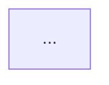
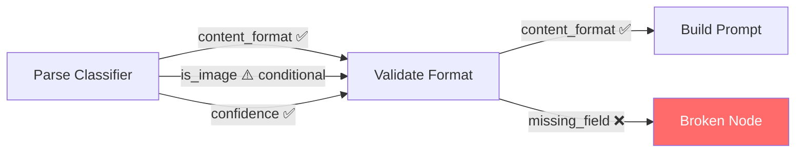

# Формат отчётов Contract Validator

## 1. Шаблон Markdown-отчёта

```markdown
# Contract Validation Report
**Workflow:** {name} (ID: {id})
**Date:** {ISO timestamp}
**Nodes analyzed:** {N} | **Connections:** {N} | **Sub-workflows:** {N}

## Summary
| 🔴 CRITICAL | 🟡 WARNING | 🔧 CONFIG | ℹ️ INFO | ❓ UNCERTAIN |
|-------------|------------|-----------|---------|--------------|
| 2           | 5          | 4         | 8       | 1            |

## 🔴 CRITICAL Issues

### 1. Отсутствующее поле `project_id`
- **Consumer:** Prepare Log Message
- **Provider:** Parse PE  
- **Строка кода:** jsCode, строка 12: `const id = data.project_id;`
- **Проблема:** Provider не создаёт `project_id` ни в одной ветке
- **Влияние:** `id` будет `undefined`, логирование сломается
- **Предлагаемое исправление:**
  ```javascript
  // В Parse PE — добавить в return:
  project_id: $json.id || $json.project_id || null,
  ```

## 🟡 WARNING Issues
...

## 🔧 CONFIG Issues (FlowLint Rules)
...

## ℹ️ INFO (неиспользуемые поля / dead ends)
...

## ❓ UNCERTAIN
...

## Contract Graph (Mermaid)


## Contract Graph (ASCII)
...
```

---

## 2. Fix Proposal — формат предложения исправления

```markdown
### Fix #N — Убрать/добавить `{field}`

**Нода:** {consumer_node_name}

**До:**
```javascript
{current_code_snippet}
```

**После:**
```javascript
{fixed_code_snippet}
```

**Объяснение:** {почему это исправляет проблему}

**Применить? (да / нет)**
```

---

## 3. Граф контрактов: правила Mermaid



**Правила иконок:**
- ✅ = всегда присутствует, совпадает
- ⚠️ = условное или есть fallback
- ❌ = полностью отсутствует → красный стиль ноды (`style X fill:#ff6b6b,color:#fff`)
- Группировать поля одного connection в одной стрелке через `\n`

**ASCII дубль для консоли:**
```
Parse Classifier ──→ Validate Format
  ├── content_format ✅
  └── is_image ⚠️ (conditional)
```

---

## 4. Формат файла истории (JSON)

Файл: `history/{workflow_id}_{YYYYMMDD_HHMMSS}.json`

```json
{
  "runId": "uuid",
  "timestamp": "2025-01-15T10:30:00Z",
  "workflowId": "7MmklECL10XWr7kz",
  "workflowName": "Input Understanding v0.4",
  "summary": { "critical": 2, "warning": 5, "config": 4, "info": 8, "uncertain": 1 },
  "issues": [
    {
      "id": "CRITICAL|project_id|Prepare Log|Parse PE",
      "level": "CRITICAL",
      "field": "project_id",
      "consumer": "Prepare Log Message",
      "provider": "Parse PE",
      "lineNumber": 12,
      "codeSnippet": "const id = data.project_id;",
      "suggestedFix": "Add project_id to return in Parse PE"
    }
  ]
}
```

**Уникальный ID issue:** `{level}|{field}|{consumer}|{provider}`  
Используется для diff между запусками.

---

## 5. Формат Diff-отчёта

```markdown
# Contract Testing DIFF: {Workflow Name}
**Run #N** (2025-01-15) vs **Run #N-1** (2025-01-10)

## Тренд
| Уровень | Было | Стало | Δ |
|---------|------|-------|---|
| 🔴 CRITICAL | 3 | 2 | -1 ✅ |
| 🟡 WARNING | 5 | 5 | 0 |
| ℹ️ INFO | 8 | 7 | -1 ✅ |

## 🆕 НОВЫЕ проблемы (регрессии)
- 🔴 CRITICAL: `model_hint` не найден: Model Selector → Map to Pipeline

## ✅ ИСПРАВЛЕННЫЕ проблемы
- 🔴 CRITICAL: `project_id` в Parse PE → Prepare Log — FIXED

## 📊 БЕЗ ИЗМЕНЕНИЙ
- 3 WARNING, 5 INFO — без изменений
```
